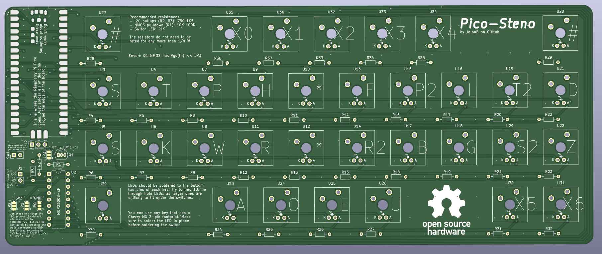
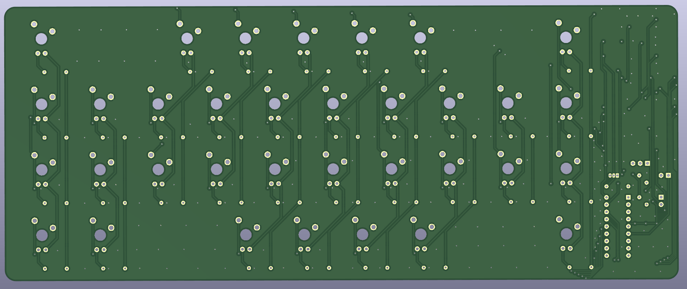

# Pico-Steno

An open-source Raspberry Pi Pico stenography keyboard.

I promise I'll write more here soon.

Gerber files can be found [here](hardware/gerber/).
I have not yet ordered a PCB with these gerber files, so they may have issues.

The bill of materials can be found [here](docs/bom/).





## Setup

### Flashing Pico

<!-- TODO add instructions for flashing the circuitpython firmware -->

To begin, you need to have `circup` installed so you can add libraries to your Pico.
Start by installing the dependencies:

```shell
sudo apt install -y git python3 python3-pip
```

And then install `circup`:


```shell
pip3 install --upgrade pip
pip3 install circup
```

You can update `circup` by running:

```shell
pip3 install --upgrade circup
```

Now, you can simply install the packages by plugging in your Pico which is running CircuitPython and running:

```shell
cd src/
circup install -r requirements.txt
```

### Compiling Code

To compile the code, you need `mpy-cross` installed on your PC.
You can download it from [here](https://adafruit-circuit-python.s3.amazonaws.com/index.html?prefix=bin/mpy-cross/) and download the latest version for your operating system (or look [here](https://learn.adafruit.com/welcome-to-circuitpython/frequently-asked-questions#how-can-i-create-my-own-mpy-files-3020687-11) if the link is dead).

<!-- TODO add more notes here
Probably only need to compile the custom code, not the libraries. Might as well use circup (https://learn.adafruit.com/keep-your-circuitpython-libraries-on-devices-up-to-date-with-circup/prepare)
Later, could add an explanation for how to build a whole circuit python firmware with custom lib?? -->

### Loading .mpy files onto Pico

## Questions

### Why doesn't this use a keyboard matrix?

Good question.

1. The RPi Pico has enough GPIO pins to dedicate one to each key on a stenography keyboard.
Basically, I just though that was neat, so decided to do it that way.
I then decided I wanted optional extra keys, so added the IO extender.
1. This allows me to implement n-key rollover without needing any diodes; not that they are particularly expensive.

### Why is the circuit so messy?

That's what happens when each key is connected directly to the microcontroller without optimising the which switch connects to which pin.  
But hey, this is open source; if it bugs you, feel free to fork it!

## I can't detect my board

```shell
pip3 install adafruit-board-toolkit
python3 -c "import adafruit_board_toolkit.circuitpython_serial; print(adafruit_board_toolkit.circuitpython_serial.data_comports()[0].device)"
```

If you get `IndexError: tuple index out of range`, then no data port was detected.